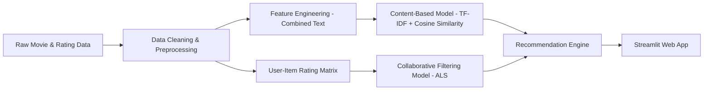

# 🎬 Movie Recommendation System  
### *Hybrid Content-Based & Collaborative Filtering Recommender Built with PySpark*

This repository contains an end-to-end **Movie Recommendation System** implemented entirely in a single notebook.  
It includes **data preprocessing, exploratory data analysis (EDA), content-based filtering, collaborative filtering (ALS), model evaluation, and a Streamlit web application**.

---

## Project Structure

```
Movie-Recommender-System
├── movie_recommender.ipynb    # Main notebook: cleaning, EDA, models, evaluation, Streamlit app
└── README.md                   # Project documentation
```

> All work is included in one well-organized notebook for easy reproducibility and final project submission.

---

## Overview

This project builds a scalable and interpretable movie recommendation system using:

- **Content-Based Filtering** (TF-IDF + Cosine Similarity)  
- **Collaborative Filtering** using **PySpark ALS**
- **Interactive Streamlit Web App** for user-facing recommendations

The entire pipeline—from raw data to deployment—is implemented in the single notebook.

---

## Dataset Information

We use a TMDB/MovieLens-style dataset containing:

### **Movies Metadata**
- Movie ID  
- Title  
- Genres  
- Overview  
- Cast (top actors)  
- Crew (director)  
- Keywords  
- Production countries  
- Spoken languages  
- Release date  

### **Ratings**
- User ID  
- Movie ID  
- Rating  
- Timestamp  

Nested JSON-like fields are cleaned using PySpark.

---

## Technologies Used

| Area | Tools |
|------|-------|
| Data Processing | PySpark, Pandas |
| Modeling | TF-IDF, Cosine Similarity, ALS |
| Visualization | Matplotlib |
| Deployment | Streamlit |
| Environment | Python 3.x |

---

## Exploratory Data Analysis (EDA)

The notebook includes in-depth EDA exploring:

- Rating distribution  
- Number of movies released by year  
- Genre distribution  
- User activity (long-tail distribution)  
- Most popular movies  
- Metadata sparsity patterns  

Visualizations are generated directly inside the notebook.

---

## Methodology

### **Content-Based Filtering**

The system creates a combined text representation using:

```
overview + genres + keywords + cast + director
```

Using:
- **TF-IDF vectorization**
- **Cosine similarity matrix**

It returns the **Top-N most similar movies** to any given movie title.

---

### **Collaborative Filtering (ALS)**

The system uses PySpark’s **ALS (Alternating Least Squares)** to build a model based on user–movie interactions.

It includes:
- Train/test split  
- Hyperparameter tuning  
- Predictions  
- Ranking metrics (Precision@K, Recall@K)
- RMSE evaluation  

ALS provides **personalized recommendations** for any user ID.

---

## Model Evaluation

Metrics computed in the notebook:

| Metric | Content-Based | ALS |
|--------|----------------|------|
| RMSE | N/A | *value shown in notebook* |
| Precision@K | ✓ | ✓ |
| Recall@K | ✓ | ✓ |

The notebook also includes detailed performance comparison and interpretation.

---

## System Architecture



---

## Streamlit Web App

The final section of the notebook includes a Streamlit interface with:

### **Modes**
- **Movie-based search** (Content-Based)  
- **User-based recommendations** (ALS)

### **Features**
- Clean sidebar navigation  
- Top-N movie recommendations  
- Optional movie poster support  
- Metadata: genres, year, similarity/predicted rating  

You can run the app using:

```
streamlit run app.py
```

*(If extracted from the notebook. The notebook shows full example code.)*

---

## How to Run the Notebook

### 1. Clone the repository

```
git clone https://github.com/yourusername/Movie-Recommender-System.git
cd Movie-Recommender-System
```

### 2. Install dependencies  
*(Optional if using Colab)*

```
pip install -r requirements.txt
```

### 3. Open the notebook

```
jupyter notebook movie_recommender.ipynb
```

Or open directly in Google Colab.
