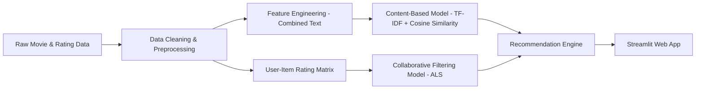

# 🎬 Movie Recommendation System  
### *A Big Data Pipeline for Distributed Movie Recommendation using PySpark*

This repository contains an end-to-end **Big Data movie recommendation project** implemented in a single PySpark notebook.  
The project focuses on **large-scale data processing**, **distributed computation**, **multi-source data integration**, and the construction of a scalable recommendation pipeline.

---

## Steps to Reproduce Results

### 1. Download Datasets

We use two main datasets:

**Dataset 1: MovieLens Small Dataset**
- Download from: [MovieLens Dataset](https://www.kaggle.com/datasets/rounakbanik/the-movies-dataset)
- Files needed:
  * `ratings_small.csv` (~100K ratings)
  * `movies_metadata.csv` (~45K movies)
  * `keywords.csv` (plot keywords)
  * `credits.csv` (cast and crew info)
  * `links.csv` (ID mappings)

**Dataset 2: TMDB 5000 Movie Dataset**
- Already included in the Kaggle link above
- Provides rich metadata for content-based filtering

---

### 2. Setup Environment

1. **Upload the notebook to Google Colab:**
   - Go to [Google Colab](https://colab.research.google.com/)
   - Upload `Bigdata.ipynb`

2. **Upload datasets to Google Drive**

3. **Mount your Google Drive:**
```python
   from google.colab import drive
   drive.mount('/content/drive')
```

4. **Install PySpark:**
```python
   !pip install pyspark
```

5. **Run all cells**
   - Click `Runtime` → `Run all`
   - Estimated time: 20-30 minutes
   - Processed data will be saved to `data_clean/` folder

---

## Project Structure

```
Movie-Recommendation-System
├── Bigdata.ipynb               # Main notebook: data cleaning, integration, EDA, modeling, evaluation
├── README.md                   # Project documentation
├── data_raw/                   # Original raw datasets (MovieLens + TMDB)
├── data_clean/                 # Cleaned & processed data + saved models
└── .gitattributes              # Git LFS settings
```

> All work is included in one well-organized notebook for easy reproducibility and final project submission.

The notebook is structured into eight major stages:

1. **Setup and configuration** – Initialize PySpark and environment paths.
2. **Data loading and analysis** – Load MovieLens and TMDB datasets and inspect data quality.
3. **Data cleaning** – Normalize metadata, parse JSON fields, resolve missing values.
4. **Feature engineering** – Build TF-IDF movie profiles and prepare user-item matrices.
5. **Exploratory Data Analysis** – Analyze rating patterns, genres, user activity, and long-tail effects.
6. **Data visualization** – Produce histograms, correlation heatmaps, and genre distributions.
7. **Models** – Implement content-based similarity and train ALS collaborative filtering.
8. **Streamlit Web Application** – Provide an interactive interface for recommendations.

---

## Big Data Technologies Used

| Component | Tools |
|----------|-------|
| Distributed ETL | PySpark DataFrames, Window functions, `explode()` |
| Storage | Parquet (columnar), pickle |
| Feature Engineering | Spark transformations, UDFs |
| Modeling | Spark MLlib ALS, TF-IDF |
| Visualization | Matplotlib |
| Serving | Streamlit |
---

## System Architecture


